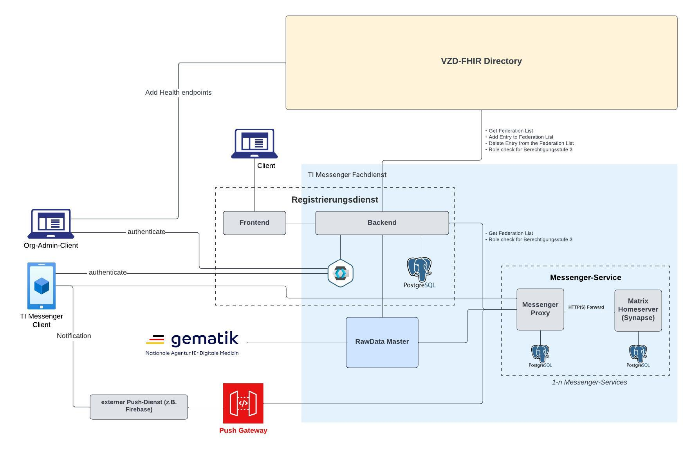
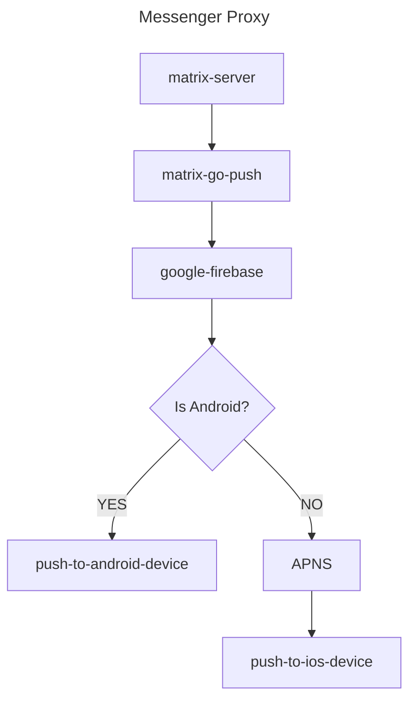

# matrix-go-push
This is a Matrix Push Gateway following the [Matrix Specification / Push Gateway API](https://spec.matrix.org/unstable/push-gateway-api/),
This Push Gateway should archive the Problems we got with [Matrix Sygnal](https://github.com/matrix-org/sygnal).

## Prerequirements
- [go1.21](https://go.dev/doc/install)
- [Firebase Service Account Key](https://firebase.google.com/docs/admin/setup/#use-oauth-2-0-refresh-token)
- [Staticcheck](https://staticcheck.io/)
- [make](https://www.gnu.org/software/make/manual/make.html)
- [go-licenses](https://github.com/google/go-licenses)

## Create LICENSES.md
Report usage to [LICENSES.md](./LICENSES.md) with [template](./third_party/go-licenses/licenses.tpl).
```shell
go-licenses report ./... --template ./third_party/go-licenses/licenses.tpl > LICENSES.MD 2> errors
````
Checking for forbidden and unknown licenses usage:
```shell
go-licenses check ./... 2> errors
```

## Build
### Build Docker image with Tests (prerequirements needed)
```shell
make docker-build IMG=matrix-go-push:v0.0.1
```
### Build Docker image without Tests
```shell
make docker-build-gitlabci IMG=matrix-go-push:v0.0.1
```

## Configure
The minimum configuration, that has to be done, is to set the ClientID from our app into the [config.yaml](./config/config.yaml)
```yaml
Server:
  Host: 0.0.0.0
  Port: 8080
  Timeout:
    Server: 30s
    Read: 15s
    Write: 15s
    Idle: 5s

Clients:
  - de.test.timref.messengerclient
```

## RUN
### Run in Docker
```shell
# Create Firebase Serviceaccount Token
mkdir develop
touch develop/serviceAccountKey.json
# Start the Container
docker run -p 8080:8080 -v $(pwd)/config/config.yaml:/config/config.yaml -v $(pwd)/develop/serviceAccountKey.json:/develop/serviceAccountKey.json matrix-go-push:v0.0.1 -config "config/config.yaml"
```

### Run with docker-compose.yaml
```shell
# Create Firebase Serviceaccount Token
mkdir develop
touch develop/serviceAccountKey.json
# Start the Container
docker compose up
```

### Run Locally
```shell
# Create Firebase Serviceaccount Token
mkdir develop
touch develop/serviceAccountKey.json
# Start the Application
go run ./... -config config/config.yaml
```

## Test Locally
You need to get a PushKey from synapse Database:
```sql
select * from pushers;
```
After you got a Pushkey, you can insert the Pushkey in the Curl Request, you need the registered APP_ID in the folowwing curl request and in the [config.yaml](./config/config.yaml)
```shell
curl -i -H "Content-Type: application/json" --request POST -d '@-' 127.0.0.1:8080/_matrix/push/v1/notify <<EOF
{
  "notification": {
    "event_id": "\$3957tyerfgewrf384",
    "room_id": "!slw48wfj34rtnrf:example.org",
    "type": "m.room.message",
    "sender": "@hmueller:matrix.example.org",
    "sender_display_name": "Major Tom",
    "room_name": "Mission Control",
    "room_alias": "#exampleroom:example.org",
    "prio": "high",
    "content": {
      "msgtype": "m.text",
      "body": "I'm floating in a most peculiar way."
    },
    "counts": {
      "unread": 2,
      "missed_calls": 1
    },
    "devices": [
      {
        "app_id": "de.test.timref.messengerclient",
        "pushkey": "$PUSHKEY",
        "pushkey_ts": 12345678,
        "data": {},
        "tweaks": {
          "sound": "bing"
        }
      }
    ]
  }
}
EOF
```

## Architecture Overview




## [Libraries](./LICENSES.md)
  - [Firebase Admin Go SDK](https://github.com/firebase/firebase-admin-go#license-and-terms); [Apache License, version 2.0](http://www.apache.org/licenses/LICENSE-2.0)
  - [gorilla/mux](https://github.com/gorilla/mux#license); [BSD licensed](https://github.com/gorilla/mux/blob/main/LICENSE)
  - [prometheus/client_golang](https://github.com/prometheus/client_golang); [Apache License, version 2.0](https://github.com/prometheus/client_golang/blob/main/LICENSE)
  - [stretchr/testify](https://github.com/stretchr/testify); [MIT license](https://github.com/stretchr/testify/blob/master/LICENSE)
  - [uber-go/zap](https://github.com/uber-go/zap); [MIT license](https://github.com/uber-go/zap/blob/master/LICENSE.txt)
  - [googleapis/google-api-go-client](https://github.com/googleapis/google-api-go-client); [BSD-3-Clause license](https://github.com/googleapis/google-api-go-client/blob/main/LICENSE)
  - [go-yaml/yaml](https://github.com/go-yaml/yaml); [MIT and Apache](https://github.com/go-yaml/yaml/blob/v3/LICENSE)